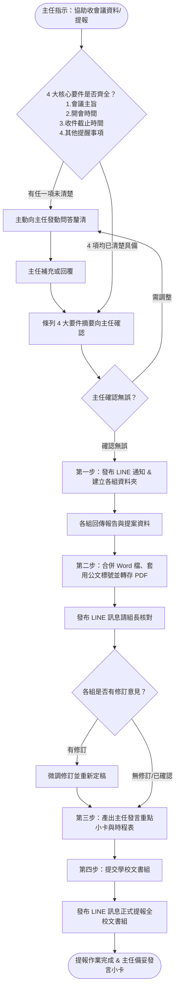

# 教務處會議資料彙整與提報標準作業程序 (SOP)

本標準作業程序（SOP）旨在規範教務處籌辦校務會議、行政會報等全校性會議之資料收集、彙整編排、組內檢核至送交學校文書組之標準化作業流程，確保處內溝通順暢、文稿體例嚴謹合規。

---

## 核心協作原則：先問答釐清、確認後開工 (Pre-Flight Q&A & Confirmation Gate)

> 🚨 **首次啟動協作鐵律**：
> 當主任第一次提出協助處理會議提報、或要求「幫我收會議資料」時，Agent **必須主動確認以下 4 大核心資訊**：
> 1. **會議的主旨是什麼**（會議全銜與主要討論主題）
> 2. **開會的時間**（具體開會日期、星期幾與起訖時間）
> 3. **跟各位組長收繳資料的時間**（回傳報告與提案之具體截止期限）
> 4. **可能有什麼其他的提醒事項**（特殊叮嚀、特定重要進度報告、或規章修正案對照表要求等）
>
> ⚠️ **若主任在指示中未完整提及上述 4 大要件，Agent 絕對不可自行猜測填寫，亦不可逕行產出草稿，必須主動向主任提問，逐項問清楚並經主任確認無誤後，方可正式開工！**

---

## 流程架構總覽 (Workflow Overview)



---

## 零、首次啟動必備 4 大要件檢核與問答清單 (Pre-Flight 4-Core Inquiries)

在啟動第一步建立資料夾與產生文案前，必須嚴格查對並填妥以下檢核表：

| 要件編號 | 必查項目 | 具體內容定義 | 檢核狀態 |
| :---: | :--- | :--- | :---: |
| **1** | **會議的主旨** | 會議法定全銜與主題（如：114學年度第1學期第2次行政會報） | ［未釐清／已確認］ |
| **2** | **開會的時間** | 具體開會日期、星期、時段（如：114年9月18日星期三 14:00） | ［未釐清／已確認］ |
| **3** | **收繳資料時間** | 跟各位組長收繳報告與提案之具體截稿時限（如：9月15日週一 12:00 前） | ［未釐清／已確認］ |
| **4** | **其他提醒事項** | 特殊事項提醒（如：高三模擬考時程排定、設備盤點進度、規章修正需檢附對照表等） | ［未釐清／已確認］ |

> 💬 **向主任啟動問答話術範例（任一項缺漏時主動發動）**：
> 「主任您好！收到您的會議籌備指示。為確保資料收繳與排版精準無誤，開工前需先向您請教並確認以下 4 項關鍵資訊：
> 1. **會議主旨**：本次會議的正式主題/全銜為何？
> 2. **開會時間**：預計開會的日期與時間是？（如：○月○日星期○ ○點）
> 3. **收件時間**：預計跟 5 位組長收繳資料的截止時間是？（如：○月○日 12:00 前）
> 4. **其他提醒事項**：本次是否有任何特定提醒？（例如：重點工作催辦、特定計畫報告、或提案需附對照表等）
> 
> 請主任撥冗回覆，我確認完畢後會立即為您建立各組資料夾並生成第一階段 LINE 通知文案！」

---

## 第一步：收資料與通知 (會前資料徵集)

### 1. 建立本次會議資料夾與各組子目錄
確認 4 大要件並經主任核可後，於會議專屬目錄中建立各組獨立子目錄存放原始檔：

- **目錄結構範例**：
  ```text
  [YYYYMMDD_會議名稱]/
  ├── 00_彙整定稿/        (存放最後合併的 Word 與 PDF、發言小卡與時程表)
  ├── 01_教學組/          (存放教學組提供之報告與提案原始檔)
  ├── 02_註冊組/          (存放註冊組提供之報告與提案原始檔)
  ├── 03_設備組/          (存放設備組提供之報告與提案原始檔)
  ├── 04_課務組/          (存放課務組提供之報告與提案原始檔)
  └── 05_實驗研究組/      (存放實驗研究組提供之報告與提案原始檔)
  ```

> 💡 **便利工具（PowerShell 一鍵建立目錄）**：
> 在會議專用資料夾內開啟 PowerShell，執行以下指令即可瞬間建好所有資料夾：
> ```powershell
> "00_彙整定稿", "01_教學組", "02_註冊組", "03_設備組", "04_課務組", "05_實驗研究組" | ForEach-Object { New-Item -ItemType Directory -Name $_ -Force }
> ```

---

### 2. LINE 群組發布「收資料與提案」通知
- **發送對象**：教務處組長工作群組（教學組、註冊組、設備組、課務組、實驗研究組）
- **文字範本**（純文字格式，直接複製貼上即可發送；已完整融入開會時間與其他提醒）：

```text
【📢 教務處會議資料填報通知】

各位組長辛苦了：

學校即將召開【會議主旨，如：114學年度第1學期第2次行政會報】，請各組協助彙整並回傳本次會議之工作報告與提案討論資料。

🗓️ 會議時間：【開會日期與時間，如：114年○月○日（星期○）14:00】
📍 開會地點：【會議室／行政會議室】
⏰ 資料回傳截止時間：
請於【○月○日（星期○）12:00 前】將檔案回傳至本群組或主任處，以利後續彙整排版。

📝 資料填報要件：
1. 工作報告：請列出近期待辦重要業務或已完成具體成效（請以條列式簡要陳述）。
2. 提案討論（若無提案免填）：
   • 提案名稱（案由）
   • 說明（現況背景與提案理由）
   • 辦法（具體執行方案與期程）
   • 檢附修訂對照表：凡涉及校內規章、要點、實施計畫之新訂或修正，務必檢附「修訂前後對照表」Word 檔。

💡 其他提醒事項：
【填入其他提醒事項，如：本次請各組特別留意新學期專案經費核銷進度／高三模擬考日程排定等；若無特殊提醒此項可省略】

收到通知請於群組按個貼圖或回覆「收」，謝謝大家的配合與協助！💪
```

---

## 第二步：文件彙整與檢視 (排版與組內校對)

### 1. 各組報告編排順序與標準資料範本
收到各組回傳之檔案後，彙整合併為一份完整的 Word 檔（.docx）。
- **強制排列順序**：
  1. 教學組
  2. 註冊組
  3. 設備組
  4. 課務組
  5. 實驗研究組
- **標題命名規範**：
  - ❌ **嚴禁冠上組別編號**（例如：不要寫「第一組 教學組」、「第 1 組」）。
  - ✔️ **直接以規定之組別全銜為標題**。

#### 📋 教務處會議宣導資料與提案標準整合範本
各組組長繳交資料後，請一律套用以下標準結構進行整齊彙整，將各組繳交之報告、宣導事項與各組提案整合於對應標題下方：

```markdown
{日期} {會議名稱} 教務處宣導資料

※教學組宣導資料：
一、...
（一）...

※註冊組宣導資料：
一、...
（一）...

※設備組宣導資料：
一、...
（一）...

※課務組宣導資料：
一、...
（一）...

※實驗研究組宣導資料：
一、...
（一）...


※教務處討論提案：

【提案一】
案由：修正「本校學生在校學習評量補充規定」部分條文案，提請審議。
提案單位：教學組
說明：
一、依據教育部 114 年 7 月 15 日臺教授國部字第 1140088888 號令修正「高級中等學校學生學習評量辦法」辦理。
二、配合母法修正學期學分採計及重修評量規定，擬相應修正旨揭補充規定第五點及第八點條文。
三、檢附「修正草案條文對照表」乙份（如附件）。
辦法：大會審議通過後，簽陳校長核定公布實施。

【提案二】
案由：...
提案單位：...
說明：
一、...
辦法：...
```

#### 🔍 各組提案自動檢查與附加機制 (Proposal Inspection & Attachment)
- **檔案自動巡檢**：
  在執行文件彙整時，Agent 必須逐一檢查五個組別資料夾（`01_教學組` 至 `05_實驗研究組`）內的所有交件檔案。
- **提案判定標準**：
  若檔案內容含有「案由」、「提案標題」、「說明」、「辦法/建議」或檢附「修訂前後對照表」等提案要件，即判定為該組之正式提案。
- **附加於說明 Word 文件中**：
  若檢查出各組有提案，必須自動將該提案提取並編修為標準體例，緊接在五組宣導資料之後，建立「※教務處討論提案：」獨立章節附加在說明 Word 文件當中；若包含規章修正對照表，亦一併以標準三欄表格緊接附於該案辦法之後。
- **無提案處理**：
  若檢查五組資料夾皆無提案檔案，則 Word 文件自動維持純宣導資料，省略討論提案區塊。

> 📌 **彙整鐵律**：
> 後續無論是人工彙整或由 AI Agent 自動整合，**一律嚴格遵循上述範本結構**，將各組收繳資料整齊置於各組標題下方，若有提案一律依檢核機制自動附加於後方，確保全文格式統一、層次分明。


### 2. 彙整 Word 文件之排版格式硬性規範 (Word Layout Standards)
最後彙整合併產出之 Word 文件（.docx），必須嚴格符合以下格式標準：

- **字型**：全文統一設定為 **微軟正黑體**（中英文字型一致）。
- **字型大小**：全文統一採用 **14 號字**（14pt）。
- **行距**：統一設定為 **單行間距**（Single Line Spacing）。
- **頁面邊界**：A4 版面，**上、下、左、右 皆設定為 1 公分**（1.0 cm / 28.35 pt）。
- **段落間距**：**主標題與第一組之間、各組宣導資料之間，必須保留一個空白行**，使視覺版面呼吸舒適、組別切換清楚分明。
- **自動編號功能**：若原本各組繳交之文件內容含有條列編號（如 一、二、三... 或 1、2、3...），**一律改為套用 Word 內建原生的「自動編號」功能**，不得使用手打空白或硬編碼純文字編號。
- **標號與標點全形**：編號層次參照全域規範（`../../AGENTS.md`）之標準標號層級（一、（一）、1、（1）、(i) 嚴禁跳級），標點符號一律為全形。

---

### 3. Word 產出自動檢查格式流程與自修復機制 (Automated Formatting Verification & Self-Healing SOP)
在產生 Word 檔案（.docx）及轉出 PDF 檔後，**Agent 或承辦人必須立即啟動「自動檢查格式流程」**，對產出檔案進行全自動化的格式掃描與品質合規性判定。**凡有任一項指標不合格，必須立刻阻斷提報，自動啟動自修復修正並重新生成，直至 100% 全數通過檢驗為止**。

```
[產出 Word / PDF] ──> 【自動檢查格式流程】
                             ├─ 邊界檢查 (四邊 1.0cm)
                             ├─ 字型字級 (微軟正黑體 14pt)
                             ├─ 單行間距與留白行
                             ├─ 編號型態檢核 (斷言排除甲乙丙丁天干)
                             ├─ 各組獨立重設檢核 (每組自「一、」起算)
                             └─ 凸排縮行檢核 (換行文字向右縮進對齊)
                                      │
                 ┌────────────────────┴────────────────────┐
                 ▼                                         ▼
            [全數合格 PASS]                          [發現任一項異常 FAIL]
                 │                                         │
        進入下一步：組內校對與報送              🚨 觸發自修復回路：修正參數、重新產出並重測
```

#### 📋 六大核心自動檢查指標與判定標準 (Verification Checkpoints)：
1. **頁面邊界檢核 (Page Setup)**：
   - **標準**：A4 版面，上、下、左、右邊界**皆嚴格等於 1.0 公分**（28.35 pt）。
   - **判定**：誤差超過 0.05 公分即判定不合格。
2. **字型與字級檢核 (Font & Size)**：
   - **標準**：全文段落（包含標號、英文、數字、內文）一律為 **微軟正黑體**（中英文一致）。
   - **標準**：全文統一為 **14 號字**（14pt），大標題與各組標籤加粗（Bold）。
   - **判定**：檢測到新細明體、Times New Roman 或字級非 14pt 即判定不合格。
3. **行距與段落留白檢核 (Spacing & Blank Lines)**：
   - **標準**：統一設定為 **單行間距**（Single line spacing），無額外段前段後贅餘高度。
   - **標準**：大標題與第一組之間、組與組之間、宣導資料與討論提案之間，**必須保留一個空白行**。
4. **編號型態檢核（嚴禁天干防錯斷言）**：
   - **標準第一層**：中文大寫數字「`一、`、`二、`、`三、`...」（Word 繁中樣式常數 35）。
   - 🚨 **絕對斷言**：**嚴格禁止出現天干編號「`甲、`、`乙、`、`丙、`、`丁、`...」**（常數 30）。若掃描到天干編號，直接判定為嚴重程式錯誤並強制阻斷！
   - **標準第二層**：阿拉伯數字「`1、`、`2、`、`3、`...」（Word 樣式常數 0）。
   - **標準第三層**：全形數字括號「`（1）`、`（2）`...」或全形中文括號「`（一）`、`（二）`...」。
5. **各組獨立重新起算檢核 (Group Scope Isolation)**：
   - **標準**：五個組別（教學組、註冊組、設備組、課務組、實驗研究組）及「討論提案說明」，其第一層清單項目的起始標號**必須全數重新自「`一、`」起算**，嚴禁跨組別接續累加。
6. **縮行（凸排 Hanging Indent）與階梯縮排檢核**：
   - **標準縮行**：自動編號段落必須設定凸排縮行（`FirstLineIndent = -28pt`），當條文內容超過一行換行時，**第二行以後之文字必須向右縮進對齊於第一行文字起點，絕對不可向左突出卡在標號下方**。
   - **標準階層縮排**：第二層（1、2...）左縮排 56pt，第三層（（1）、（2）...）左縮排 84pt，階次井然有序。

---

#### 💻 自動檢查執行腳本範本 (PowerShell Automated Harness)：
Agent 每次產生 Word 定稿後，可呼叫以下標準驗證腳本自動執行六大檢核並回傳結果：

```powershell
# Word 產出自動檢查格式驗證腳本
$word = New-Object -ComObject Word.Application
$word.Visible = $false
$doc = $word.Documents.Open($docxPath)

$errors = @()
$cm = 28.3465

# 1. 邊界檢核
$top = [math]::Round($doc.PageSetup.TopMargin / $cm, 2)
if ($top -ne 1.0) { $errors += "上邊界不符: $top cm (應為 1.0cm)" }

# 2. 逐段巡檢編號、縮行與字型
$listCount = 0
foreach ($p in $doc.Paragraphs) {
    $txt = $p.Range.Text.Trim()
    if ([string]::IsNullOrWhiteSpace($txt)) { continue }
    
    # 字型字級檢核
    if ($p.Range.Font.NameFarEast -ne "微軟正黑體") { $errors += "字型非微軟正黑體: $txt" }
    if ($p.Range.Font.Size -ne 14) { $errors += "字級非 14pt: $txt" }
    
    # 清單編號檢核
    if ($p.Range.ListFormat.ListType -ne 0) {
        $listCount++
        $listStr = $p.Range.ListFormat.ListString
        
        # 嚴禁天干斷言
        if ($listStr -match "^[甲乙丙丁戊己庚辛壬癸]") {
            $errors += "【嚴重錯誤】檢測到天干編號 '$listStr' (內容: $txt)"
        }
        
        # 凸排縮行斷言
        if ($p.Format.FirstLineIndent -ge 0 -or $p.Format.LeftIndent -le 0) {
            $errors += "未正確縮行 (凸排): $txt"
        }
    }
}

$doc.Close(0)
$word.Quit()

if ($errors.Count -gt 0) {
    Write-Error "格式自動檢查未通過，共 $($errors.Count) 項違規！"
    $errors | ForEach-Object { Write-Host " - $_" }
    exit 1
} else {
    Write-Host "【檢驗通過】Word 產出格式 100% 合規（邊界1cm、微軟正黑體14pt、無天干、縮行凸排正確）！"
    exit 0
}
```

---

#### 🔄 自修復與重新修正回路 (Self-Healing Workflow)：
- **觸發條件**：自動檢查流程回報任一項錯誤（Exit Code 1）。
- **修復步驟**：
  1. Agent 立即比對失敗之檢查指標（如天干殘留、縮行不足、邊界偏移）。
  2. 自動修正轉換代碼中之 Word COM 參數（如修正 ListTemplate 常數、重新設定 LeftIndent/FirstLineIndent）。
  3. 強制終止任何背景鎖定進程（`taskkill /F /IM WINWORD.EXE`）。
  4. 重新產出 Word 檔（.docx）與 PDF 檔（.pdf）。
  5. 再次執行自動檢查格式流程，直到回傳 `Exit Code 0`（全數通過），方得交付成果。

---

### 4. 匯出成果與 LINE 組內校對檢核
彙整完畢後，另存一份 **Word 檔 (.docx)** 與一份 **PDF 檔 (.pdf)** 存放於 `00_彙整定稿/`。
將 PDF 檔傳至組長群組進行初審校對。

- **發送對象**：教務處組長工作群組
- **文字範本**（純文字格式，直接複製貼上即可發送）：

```text
【📋 會議資料初稿校對檢視】

各位組長好：

本次【填入會議主題，如：第2次行政會報】教務處彙整資料已排版完成（如附檔 PDF）。

請各位組長撥冗協助檢視確認：
1. 貴組之工作報告內容、數據與日期是否有疏漏或需補充？
2. 各項提案名稱、法規條號及修訂前後對照表是否完整無誤？

⏰ 確認回報期限：
若有需微調之處，請於【○月○日（星期○）16:00 前】於群組提出或私訊告知，逾時將以本版本定稿並送交文書組。

辛苦大家，感謝大家的細心協助！🙏
```

---

## 第三步：產出主任會議發言重點小卡與重要時程表

在各組資料整合完畢後，為協助主任在全校性會議中精準發言、避免逐字朗讀冗長細節，必須同步提煉產出兩項實體主持輔助工具，存檔於 `00_彙整定稿/[YYYYMMDD]_發言重點小卡與時程表.md`：

### 1. 主任發言重點提示小卡 (Meeting Cue Card)
- **設計原則**：
  - 詳細文字細節請與會同仁「自行參閱手冊」，主任僅需口頭提點核心事項。
  - **嚴格精簡**：拒絕長篇大論，每組僅保留「手冊位置」與「2~4 個關鍵提示詞」，使主任一眼即可喚醒記憶。
  - 依照處內五組順序及提案依序排列。
- **提示小卡標準格式範例**：

```markdown
# 🎙️ 教務主任會議發言重點小卡

> 💡 **開場引言**：「校長、各位同仁大家早，教務處詳細工作報告與提案請大家參閱大會手冊，以下就重點事項向大家做摘要提示：」

### 1. 【教學組】（手冊 P.2，報告二）
- 📍 **手冊位置**：第 2 頁，教學組工作報告第（二）項
- 🔑 **關鍵提示詞**：高三模考日程、段考命題試卷繳交（10/12前）、早自修巡堂
- 🗣️ **口語提點**：「特別提醒命題老師留意 10/12 命題送印期限，高三第一次模考請各班依課表監考。」

### 2. 【註冊組】（手冊 P.3，報告一、三）
- 📍 **手冊位置**：第 3 頁，註冊組工作報告第（一）、（三）項
- 🔑 **關鍵提示詞**：高一新生學籍核定、成績登錄截止日、減免學雜費複查
- 🗣️ **口語提點**：「各項學雜費減免與成績登錄時間點，請導師與任課老師參閱手冊。」

### 3. 【設備組】（手冊 P.4，報告一）
- 📍 **手冊位置**：第 4 頁，設備組工作報告第（一）項
- 🔑 **關鍵提示詞**：專科教室借用系統改版、教科書盤點回報
- 🗣️ **口語提點**：「專科教室借用已改至線上系統，請各科召集人協助宣導。」

### 4. 【課務組】（手冊 P.5，報告二）
- 📍 **手冊位置**：第 5 頁，課務組工作報告第（二）項
- 🔑 **關鍵提示詞**：第八節輔導課調代課規範、差假代課系統登錄
- 🗣️ **口語提點**：「第八節調代課請同仁務必於前一日完成行政手續。」

### 5. 【實驗研究組】（手冊 P.6，報告一）
- 📍 **手冊位置**：第 6 頁，實研組工作報告第（一）項
- 🔑 **關鍵提示詞**：優質化計畫期中檢核、自主學習計畫學生上傳
- 🗣️ **口語提點**：「自主學習計畫指導老師請於本週五前完成線上審核。」

---

### 6. 【討論提案摘要】（若有提案）
- 📍 **手冊位置**：手冊第 8 頁，提案一
- 🔑 **關鍵提示詞**：修正學生在校學習評量補充規定、配合教育部母法調修第 5 條
- 🗣️ **口語提點**：「本案已檢附新舊條文對照表，修正重點為...建請委員會審議通過。」
```

---

### 2. 重要時間提醒一覽表 (Chronological Timetable)
自各組報告與提案中，提取所有具體的時間點、截止日期、重要事件，依**時間先後順序**編排成清單，供主任在會議結尾時逐項提醒與會同仁：

| 日期與時間 | 權責組別 | 重要事項名稱 | 會議口頭提醒重點 |
| :---: | :---: | :--- | :--- |
| **09/22 (五) 17:00** | 實驗研究組 | 高一二自主學習計畫審查截止 | 請指導老師務必於系統完成審核 |
| **10/05 (四) 12:00** | 教學組 | 第一次定期考查命題試卷繳交 | 請命題教師如期繳卷以利油印 |
| **10/12 (四) ~ 10/13 (五)** | 教學組 | 全校第一次定期考查 | 請各監考教師準時到場監試 |
| **10/20 (五) 24:00** | 註冊組 | 定期考查成績系統登錄截止 | 請任課教師如期完成成績登錄 |

---

## 第四步：提交學校文書組 (正式報送)

各組確認內容無誤並完成微調後，產出最終版 Word 檔與 PDF 檔，正式發送給學校全校會議承辦人（文書組組長）。

### 1. 提交前檢查清單 (Pre-Submission Checklist)
- [ ] 五組順序正確：教學組 ➔ 註冊組 ➔ 設備組 ➔ 課務組 ➔ 實驗研究組。
- [ ] 各大標題無「第幾組」字樣，標號層級（一、(一)、1、(1)）完整一致。
- [ ] 全文標點符號皆為全形。
- [ ] 規章修訂案皆已檢附完整之「修訂前後對照表」。
- [ ] 已產生最新版 Word 檔 (.docx) 與 PDF 檔 (.pdf)。
- [ ] 主任發言重點小卡與重要時程表已提煉完畢並存檔。

---

### 2. LINE 發送給文書組組長之文字訊息
- **發送對象**：學校文書組組長（或全校會議承辦人）
- **文字範本**（純文字格式，直接複製貼上即可發送）：

```text
文書組長您好：

教務處本次提報【填入會議主題，如：114學年度第1學期第2次行政會報】之會議資料已彙整校對完畢，隨函檢附電子檔供您編排全校議程手冊。

📁 檢附檔案：
1. 教務處工作報告與提案彙整表（Word 檔）
2. 教務處工作報告與提案彙整表（PDF 檔）
3. 【若有提案附件，如：附件_學生學籍管理要點修訂前後對照表.docx】

📊 提報內容摘要：
• 處內業務報告：共計 5 組（教學組、註冊組、設備組、課務組、實驗研究組）
• 討論提案：共【○】案（含法規修正對照表）

若排版上有任何需要調整或補件的地方，敬請隨時與教務處聯繫，謝謝您！辛苦了！😊

---

## 附錄：標準修訂前後對照表格式範例 (規章提案用)

若各組有法規、要點或實施計畫修正案，請要求組長使用此標準三欄表格格式檢附：

| 現行條文（修訂前） | 修正條文（修訂後） | 說明（修正理由） |
| :--- | :--- | :--- |
| 第三點 本校各項獎學金申請應於每學期開學後兩週內提出。 | 第三點 本校各項獎學金申請應於每學期**開學後三週內**提出。 | 因應開學初期加退選作業時程，放寬學生申請期限一週。 |
| 第五點 （原條文略） | 第五點 （修正條文略） | 配合教育部最新法規修正用語。 |

*(註：修正條文處請以粗體或劃底線標記差異處，以利委員審閱)*
