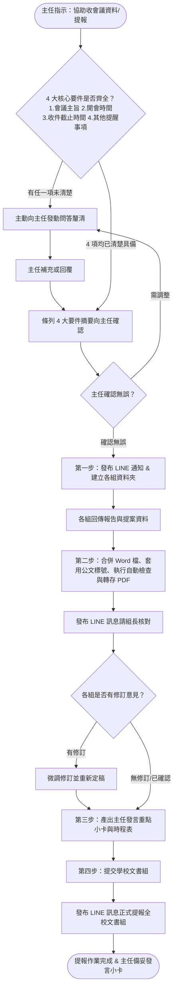

# 02_會議流程專案 AI Agent 協作規範 (Meeting Module AGENTS.md)

本規範專用於 `01_行政/02_會議流程/`，承襲全域規範與 `01_行政/AGENTS.md`。
專責學校常態會議（校務會議、行政會報、主管會議）與法定委員會（教評會、考績會、性平會、學生獎懲會）之全流程籌辦、審議把關、資料彙整與決議追蹤。

---

## 1. 目錄架構與檔案歸類指引 (Directory Structure)

本目錄嚴格遵循「**編號_中文名稱**」命名與序號連續鐵律：

```text
02_會議流程/
├── 01_會議範本/               # 標準會議空白範本庫（議程、會議紀錄與列管表、宣導資料、設定檔）
│   ├── 範本_校務行政會議議程.md
│   ├── 範本_會議紀錄與列管表.md
│   ├── 範本_教務處會議宣導資料.md
│   └── 會議設定_範本.json
├── 02_相關法規/              # 法定會議門檻與規範檢核表
│   └── 檢核_法定會議規範.md
├── 03_歷次會議/               # 模組化收納歷次正式會議工作專案與會議紀錄定稿
│   ├── 1150911_彰化區免試入學第1次籌備會/  # 籌備會議紀錄定稿（docx, pdf, md）
│   └── 1150921_擴大主管會議/             # 教務處宣導提報專案（00彙整定稿、01~05處內各組原始資料）
├── 04_工具腳本/               # 會議自動化建夾工具庫
│   └── 建立會議資料夾.ps1      # 自動產生 YYYYMMDD_會議名稱 下之 00~05 組別標準目錄
├── 99_臨時性檔案/             # [按需建立] 中間轉換暫存、臨時草稿（Git 已自動忽略）
├── README.md                 # 會議作業規範與流程指引
└── AGENTS.md                 # 本協作規範
```

### 1.1 資源引用與歸檔準則
- **空白範本取用**：籌辦新會議時，優先引用 `01_會議範本/` 內之標準範本。
- **法定程序檢核**：召開法定委員會前，強制查閱 `02_相關法規/檢核_法定會議規範.md`。
- **會議專案建立**：執行 `04_工具腳本/建立會議資料夾.ps1 -TargetPath "03_歷次會議"` 於 `03_歷次會議/` 建立專案。
- **中間過程暫存**：排版轉換中之草稿或除錯快照，一律放置於 `99_臨時性檔案/`，嚴禁散落於根目錄。
- **最終定稿交付**：會議紀錄或提報彙整定稿，統一歸檔至 `03_歷次會議/[YYYYMMDD]_[會議名稱]/`。

---

## 2. 教務處會議資料彙整與提報標準作業程序 (SOP)

本章節規範教務處籌辦校務會議、行政會報、主管會議等全校性會議之資料收集、彙整編排、組內檢核至送交學校文書組之標準化作業流程，確保處內溝通順暢、文稿體例嚴謹合規。

### 2.1 核心協作原則：先問答釐清、確認後開工 (Pre-Flight 4-Core Gate)

> 🚨 **首次啟動協作鐵律**：
> 當主任第一次提出協助處理會議提報、或要求「幫我收會議資料」時，Agent **必須主動確認以下 4 大核心資訊**：
> 1. **會議的主旨是什麼**（會議法定全銜與主要討論主題）
> 2. **開會的時間**（具體開會日期、星期幾與起訖時間）
> 3. **跟各位組長收繳資料的時間**（回傳報告與提案之具體截止期限）
> 4. **可能有什麼其他的提醒事項**（特殊叮嚀、特定重要進度報告、或規章修正案對照表要求等）
>
> ⚠️ **若主任在指示中未完整提及上述 4 大要件，Agent 絕對不可自行猜測填寫，亦不可逕行產出草稿，必須主動向主任提問，逐項問清楚並經主任確認無誤後，方可正式開工！**

#### 📋 必備 4 大要件檢核表：
| 要件編號 | 必查項目 | 具體內容定義 | 檢核狀態 |
| :---: | :--- | :--- | :---: |
| **1** | **會議的主旨** | 會議法定全銜與主題（如：115學年度第1學期第2次行政會報） | ［未釐清／已確認］ |
| **2** | **開會的時間** | 具體開會日期、星期、時段（如：115年9月18日星期三 14:00） | ［未釐清／已確認］ |
| **3** | **收繳資料時間** | 跟各位組長收繳報告與提案之具體截稿時限（如：9月15日週一 12:00 前） | ［未釐清／已確認］ |
| **4** | **其他提醒事項** | 特殊事項提醒（如：高三模擬考排定、設備盤點進度、規章修正需檢附對照表等） | ［未釐清／已確認］ |

> 💬 **向主任啟動問答話術範例（任一項缺漏時主動發動）**：
> 「主任您好！收到您的會議籌備指示。為確保資料收繳與排版精準無誤，開工前需先向您請教並確認以下 4 項關鍵資訊：
> 1. **會議主旨**：本次會議的正式主題/全銜為何？
> 2. **開會時間**：預計開會的日期與時間是？（如：○月○日星期○ ○點）
> 3. **收件時間**：預計跟 5 位組長收繳資料的截止時間是？（如：○月○日 12:00 前）
> 4. **其他提醒事項**：本次是否有任何特定提醒？（例如：重點工作催辦、特定計畫報告、或提案需附對照表等）
> 
> 請主任撥冗回覆，我確認完畢後會立即為您建立各組資料夾並生成第一階段 LINE 通知文案！」

---

### 2.2 全流程架構 (Workflow Architecture)



---

### 2.3 第一階段：會前資料徵集與通知 (Data Collection & Notification)

#### 1. 建立本次會議資料夾與各組子目錄
確認 4 大要件並經主任條列核可後，於 `03_歷次會議/` 下建立本次專屬專案目錄：
- **目錄結構**：
  ```text
  03_歷次會議/[YYYYMMDD_會議名稱]/
  ├── 00_彙整定稿/        (存放最後合併的 Word 與 PDF、發言小卡與時程表)
  ├── 01_教學組/          (存放教學組提供之報告與提案原始檔)
  ├── 02_註冊組/          (存放註冊組提供之報告與提案原始檔)
  ├── 03_設備組/          (存放設備組提供之報告與提案原始檔)
  ├── 04_課務組/          (存放課務組提供之報告與提案原始檔)
  └── 05_實驗研究組/      (存放實驗研究組提供之報告與提案原始檔)
  ```
> 💡 **自動化工具**：執行 `04_工具腳本/建立會議資料夾.ps1` 即可一鍵建立上述結構。

#### 2. LINE 群組發布「收資料與提案」通知
- **發送對象**：教務處組長工作群組（教學組、註冊組、設備組、課務組、實驗研究組）
- **文字範本**（純文字格式，直接複製貼上即可發送）：
```text
【📢 教務處會議資料填報通知】

各位組長辛苦了：

學校即將召開【會議主旨，如：115學年度第1學期第2次行政會報】，請各組協助彙整並回傳本次會議之工作報告與提案討論資料。

🗓️ 會議時間：【開會日期與時間，如：115年○月○日（星期○）14:00】
📍 開會地點：【會議室／行政會議室】
⏰ 資料回傳截止時間：
請於【○月○日（星期○）12:00 前】將檔案回傳至本群組或主任處，以利後續彙整排版。

📝 資料填報要件：
1. 工作報告：請列出近期待辦重要業務或已完成具體成效（請以條列式簡要陳述）。
2. 提案討論（若無提案免填）：
   • 提案名稱（案由）
   • 說明（現況背景與提案理由）
   • 辦法（具體執行方案與期程）
   • 檢附修訂對照表：凡涉及校內規章、要點、實施計畫之新訂或修正，務必檢附「修訂前後對照表」Word 檔。

💡 其他提醒事項：
【填入其他提醒事項，如：本次請各組特別留意新學期專案經費核銷進度／高三模擬考日程排定等；若無特殊提醒此項可省略】

收到通知請於群組按個貼圖或回覆「收」，謝謝大家的配合與協助！💪
```

---

### 2.4 第二階段：文件彙整、排版規範與自動校驗 (Compilation & Verification)

#### 1. 各組報告編排順序與提案提取機制
- **處內固定排版順序**：
  1. 教學組
  2. 註冊組
  3. 設備組
  4. 課務組
  5. 實驗研究組
- **標題命名規範**：
  - ❌ **嚴禁冠上組別編號**（不要寫「第一組 教學組」、「第 1 組」）。
  - ✔️ **直接以規定之組別全銜為標題**（如：`※教學組宣導資料：`）。
- **提案自動巡檢與附加機制**：
  - 巡檢五組資料夾，若內容含「案由」、「說明」、「辦法」或對照表，判定為正式提案。
  - 將提案提取編修為標準體例，緊接在五組宣導資料後，建立「`※教務處討論提案：`」獨立章節。
  - 若五組皆無提案，則維持純宣導資料，省略討論提案區塊。

#### 2. 彙整 Word 文件排版格式硬性標準 (Word Layout Standards)
- **字型**：全文統一設定為 **微軟正黑體**（中英文字型一致）。
- **字型大小**：全文統一採用 **14 號字**（14pt），大標題與各組標籤加粗。
- **行距**：統一設定為 **單行間距**（Single Line Spacing）。
- **頁面邊界**：A4 版面，**上、下、左、右 皆設定為 1.0 公分**（1.0 cm / 28.35 pt）。
- **段落留白**：**主標題與第一組之間、各組宣導資料之間、宣導資料與討論提案之間，必須保留一個空白行**。
- **原生自動編號**：若內容含條列編號，**一律套用 Word 內建原生的「自動編號」功能**，不得使用手打空白或純文字編號。
- **編號與標點全形**：標準層級為 `一、` ➔ `（一）` ➔ `1、` ➔ `（1）`（嚴禁跳級），標點符號一律為全形。
- **嚴禁天干編號**：斷言嚴格禁止出現 `甲、`、`乙、`、`丙、`、`丁、` 編號。
- **凸排縮行 (Hanging Indent)**：編號段落設定凸排縮行，條文換行時文字向右縮進對齊於首行文字起點，不得卡在標號下方。
- **各組獨立起算**：五個組別及討論提案說明之清單項目，**第一層標號必須全數獨立自「`一、`」起算**。

#### 3. 六大核心自動檢查指標 (Verification Checkpoints)
產出 Word 檔（.docx）及轉出 PDF 檔後，必須啟動自動檢查格式流程，凡有任一項不合格即自動觸發自修復迴路修正重產：
1. **頁面邊界檢核**：四邊邊界嚴格等於 1.0 cm（誤差 $\le 0.05$ cm）。
2. **字型與字級檢核**：微軟正黑體、14pt（排除新細明體與非 14pt）。
3. **行距與段落留白檢核**：單行間距、各組間保留空白行。
4. **編號型態檢核**：排除天干編號（甲乙丙丁），階層依序一、（一）、1、（1）。
5. **各組獨立重設檢核**：每組起始標號獨立自「一、」起算。
6. **凸排縮行檢核**：換行文字向右縮進對齊，階梯縮排有序。

#### 4. LINE 組內初稿校對訊息範本
彙整產出 Word 與 PDF 存放於 `00_彙整定稿/` 後，發送 PDF 檔至組長群組校對：
```text
【📋 會議資料初稿校對檢視】

各位組長好：

本次【填入會議主題，如：第2次行政會報】教務處彙整資料已排版完成（如附檔 PDF）。

請各位組長撥冗協助檢視確認：
1. 貴組之工作報告內容、數據與日期是否有疏漏或需補充？
2. 各項提案名稱、法規條號及修訂前後對照表是否完整無誤？

⏰ 確認回報期限：
若有需微調之處，請於【○月○日（星期○）16:00 前】於群組提出或私訊告知，逾時將以本版本定稿並送交文書組。

辛苦大家，感謝大家的細心協助！🙏
```

---

### 2.5 第三階段：主持輔助工具提煉 (Cue Card & Timetable)

資料整合完畢後，同步提煉產出兩項實體主持輔助工具，存檔於 `00_彙整定稿/[YYYYMMDD]_發言重點小卡與時程表.md`：

#### 1. 主任發言重點提示小卡 (Meeting Cue Card)
- **設計原則**：文字細節請與會同仁參閱手冊，每組僅保留「手冊位置」與「2~4 個關鍵提示詞」，口語提點口吻。
- **標準格式範例**：
```markdown
# 🎙️ 教務主任會議發言重點小卡

> 💡 **開場引言**：「校長、各位同仁大家早，教務處詳細工作報告與提案請大家參閱大會手冊，以下就重點事項向大家做摘要提示：」

### 1. 【教學組】（手冊 P.2，報告二）
- 📍 **手冊位置**：第 2 頁，教學組工作報告第（二）項
- 🔑 **關鍵提示詞**：高三模考日程、段考命題試卷繳交（10/12前）、早自修巡堂
- 🗣️ **口語提點**：「特別提醒命題老師留意 10/12 命題送印期限，高三第一次模考請各班依課表監考。」

### 2. 【註冊組】（手冊 P.3，報告一、三）
- 📍 **手冊位置**：第 3 頁，註冊組工作報告第（一）、（三）項
- 🔑 **關鍵提示詞**：高一新生學籍核定、成績登錄截止日、減免學雜費複查
- 🗣️ **口語提點**：「各項學雜費減免與成績登錄時間點，請導師與任課老師參閱手冊。」

### 3. 【設備組】（手冊 P.4，報告一）
- 📍 **手冊位置**：第 4 頁，設備組工作報告第（一）項
- 🔑 **關鍵提示詞**：專科教室借用系統改版、教科書盤點回報
- 🗣️ **口語提點**：「專科教室借用已改至線上系統，請各科召集人協助宣導。」

### 4. 【課務組】（手冊 P.5，報告二）
- 📍 **手冊位置**：第 5 頁，課務組工作報告第（二）項
- 🔑 **關鍵提示詞**：第八節輔導課調代課規範、差假代課系統登錄
- 🗣️ **口語提點**：「第八節調代課請同仁務必於前一日完成行政手續。」

### 5. 【實驗研究組】（手冊 P.6，報告一）
- 📍 **手冊位置**：第 6 頁，實研組工作報告第（一）項
- 🔑 **關鍵提示詞**：優質化計畫期中檢核、自主學習計畫學生上傳
- 🗣️ **口語提點**：「自主學習計畫指導老師請於本週五前完成線上審核。」

---

### 6. 【討論提案摘要】（若有提案）
- 📍 **手冊位置**：手冊第 8 頁，提案一
- 🔑 **關鍵提示詞**：修正學生在校學習評量補充規定、配合教育部母法調修第 5 條
- 🗣️ **口語提點**：「本案已檢附新舊條文對照表，修正重點為...建請委員會審議通過。」
```

#### 2. 重要時間提醒一覽表 (Chronological Timetable)
自各組報告與提案中，提取所有具體時間點、截止日、事件，按**時間先後排序**編排成表：
| 日期與時間 | 權責組別 | 重要事項名稱 | 會議口頭提醒重點 |
| :---: | :---: | :--- | :--- |
| **09/22 (五) 17:00** | 實驗研究組 | 高一二自主學習計畫審查截止 | 請指導老師務必於系統完成審核 |
| **10/05 (四) 12:00** | 教學組 | 第一次定期考查命題試卷繳交 | 請命題教師如期繳卷以利油印 |
| **10/12 (四) ~ 10/13 (五)** | 教學組 | 全校第一次定期考查 | 請各監考教師準時到場監試 |
| **10/20 (五) 24:00** | 註冊組 | 定期考查成績系統登錄截止 | 請任課教師如期完成成績登錄 |

---

### 2.6 第四階段：提交學校文書組 (Submission & Final Handover)

#### 1. 提交前檢查清單 (Pre-Submission Checklist)
- [ ] 五組順序正確：教學組 ➔ 註冊組 ➔ 設備組 ➔ 課務組 ➔ 實驗研究組。
- [ ] 各大標題無「第幾組」字樣，標號層級（一、(一)、1、(1)）完整一致。
- [ ] 全文標點符號皆為全形。
- [ ] 規章修訂案皆已檢附完整之「修訂前後對照表」。
- [ ] 已產生最新版 Word 檔 (.docx) 與 PDF 檔 (.pdf)。
- [ ] 主任發言重點小卡與重要時程表已提煉完畢並存檔。

#### 2. LINE 發送給文書組組長之訊息範本
```text
文書組長您好：

教務處本次提報【填入會議主題，如：115學年度第1學期第2次行政會報】之會議資料已彙整校對完畢，隨函檢附電子檔供您編排全校議程手冊。

📁 檢附檔案：
1. 教務處工作報告與提案彙整表（Word 檔）
2. 教務處工作報告與提案彙整表（PDF 檔）
3. 【若有提案附件，如：附件_學生學籍管理要點修訂前後對照表.docx】

📊 提報內容摘要：
• 處內業務報告：共計 5 組（教學組、註冊組、設備組、課務組、實驗研究組）
• 討論提案：共【○】案（含法規修正對照表）

若排版上有任何需要調整或補件的地方，敬請隨時與教務處聯繫，謝謝您！辛苦了！😊
```

---

### 2.7 附錄：標準修訂前後對照表格式範例 (規章提案用)

若各組有法規、要點或實施計畫修正案，請使用此標準三欄表格格式檢附：

| 現行條文（修訂前） | 修正條文（修訂後） | 說明（修正理由） |
| :--- | :--- | :--- |
| 第三點 本校各項獎學金申請應於每學期開學後兩週內提出。 | 第三點 本校各項獎學金申請應於每學期**開學後三週內**提出。 | 因應開學初期加退選作業時程，放寬學生申請期限一週。 |
| 第五點 （原條文略） | 第五點 （修正條文略） | 配合教育部最新法規修正用語。 |

*(註：修正條文處請以粗體或劃底線標記差異處，以利委員審閱)*


