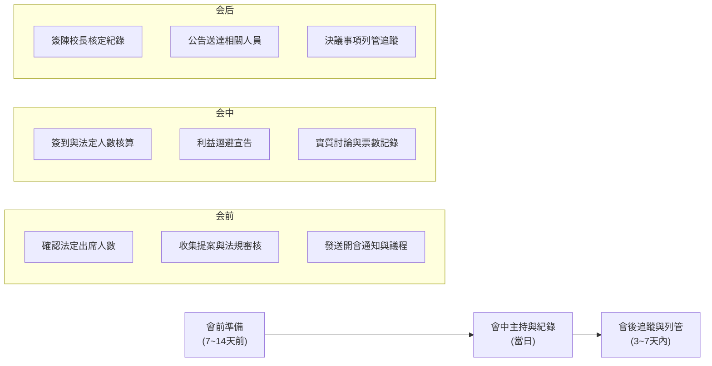

# 02_會議流程作業規範與指引

會議是推動校務運作、落實民主參與、合法決策之核心機制。本模組提供學校常規會議與法定會議（校務會議、教評會、考績會、性平會、課發會等）之全流程指引。

---

## 一、標準會議三大階段作業檢核

---

## 二、校園會議類型分類

1. **決策與立法型會議**：
   - **校務會議**：學校最高決策會議，議決校務重大事項、校規修訂、學校發展計畫。
2. **法定人事與審議委員會**：
   - **教師評審委員會 (教評會)**：教師聘任、解聘、停聘、不續聘、資遣審議（法規出席門檻極嚴）。
   - **考核委員會 / 考績會**：教師成績考核、平時考核獎懲審議。
   - **性別平等教育委員會 (性平會)**：調查處理校園性侵害、性騷擾、性霸凌事件，審議調查報告與懲處建議。
3. **教學與課程專業會議**：
   - **課程發展委員會 (課發會)**：總體課程計畫、彈性學習課程規劃與審查。
   - **教學研究會**：各科教學進度、教科書選用、評量標準與教學研究。
4. **例行行政協調會議**：
   - **行政會議 / 處室會報**：跨處室工作協調、行事曆推進、即時問題解決。
