# 校園性侵害、性騷擾或性霸凌事件處理指引 (性平法合規手冊)

依據中華民國《性別平等教育法》（簡稱性平法）及《校園性侵害性騷擾或性霸凌防治準則》，學校處理性別事件負有極嚴格之法定義務。

---

## 一、黃金 24 小時法定責任：法定通報義務

> [!WARNING]
> 依性平法第22條第3項規定，學校校長、教師、職員或工友知悉服務學校發生疑似校園性侵害、性騷擾或性霸凌事件者，**除應立即依學校防治規定通報外，並應向學校及當地直轄市、縣（市）主管機關通報，至遲不得超過二十四小時**。
> 未依規定通報者，處新臺幣三萬元以上十五萬元以下罰鍰；若情節重大致嚴重損害學生權益，主管機關得依相關法規予以解聘或免職。

### 處置第一步（24小時內）：
1. **校安通報**：學務處/生輔組至教育部校園安全暨災害防救通報處理中心填報。
2. **社政通報**：涉及未成年兒少受害時，至「關懷E-Line」進行兒少保護通報。
3. **召開性平會前置整備**：移交學校性平會專人（學務處或秘書室）列案管制。

---

## 二、性平調查法定程序時程表

```mermaid
gantt
    title 性平事件法定處理期程
    dateFormat  X
    axisFormat %d 天
    
    知悉通報 (24小時內)       :crit, a1, 0, 1
    受理審查 (20日內完成)      :active, a2, 1, 21
    性平調查 (2個月內完成)     :a3, 21, 81
    調查報告審議 (30日內)      :a4, 81, 111
    書面結果送達與申復 (30日內):a5, 111, 141
```

1. **通報與受案 (24小時內通報)**。
2. **受理審查 (20日內)**：由性平會或性平會授權之輪值小組，於接獲申請或檢舉之日起 **20日內** 以書面通知申請人或檢舉人是否受理。
3. **成立調查小組 (依法組成)**：
   - 調查小組全數成員應具備性平調查專業人員資格。
   - 女性比例應達1/2以上；涉及師生事件，外聘專家學者比例應達全體調查委員1/2以上（或依最新法規全數外聘）。
4. **調查期限 (2個月內完成，得延長1個月)**：自受理之次日起 **2個月內** 完成調查；必要時得延長，以一次為限，並應書面通知雙方當事人。
5. **召開性平會審議報告**：調查報告完成後，性平會應於 **30日內** 審議確認，並將調查結果及懲處建議提請主管機關或學校相關權責會議（如教評會、考績會、學生獎懲會）執行。
6. **送達與申復權利 (30日內提起)**：書面通知申請人、被害人及行為人，並敘明理由及救濟教示（於收受次日起 **30日內** 得以書面向學校提起申復）。

---

## 三、學校絕對禁止事項（保密與零容忍）

1. **嚴禁私下和解或隱匿**：
   - 任何人不得以「顧及校譽」、「私下協調賠償」為由阻撓通報或調查。
2. **嚴格個資保密**：
   - 調查過程、紀錄、公文，當事人一律以代號呈現（如：A生、B師）。
   - 違法洩漏性平事件個資者，主管機關得處新臺幣一萬元以上十五萬元以下罰鍰。
3. **避免二度傷害**：
   - 訪談地點應注重隱私與安全性。
   - 訪談未成年學生應有社工師、心理師或法定代理人陪同，不得重覆苛責詢問。
