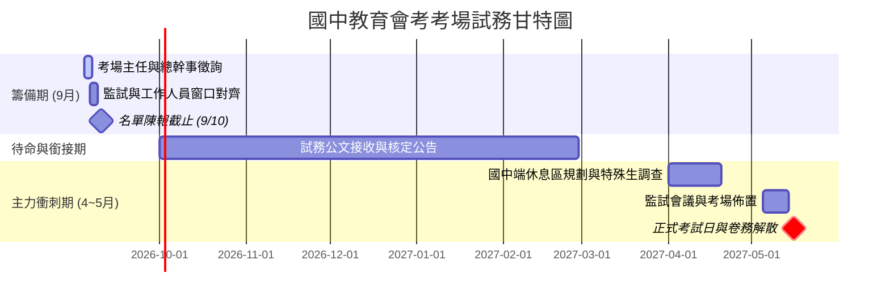

# 國中教育會考考場試務規劃與人員分工列管

> **承辦職位**：教務主任  
> **建立日期**：2026-09-04  
> **近期待辦截止日**：**2026-09-10（名單陳報截止）**  
> **專案主力執行期**：2027年 4 月至 5 月會考結束  

---

## 📩 正式公文來文摘記 (Official Memo Reference)

> **來文字號**：彰化考區 116 年國中教育會考試務工作來函  
> **公文主旨**：檢送彰化考區 116 年國中教育會考試務工作，考場學校填報資料案，請 查照。  
> **填報期限**：**115 年 9 月 10 日 (五) 前**  
> **線上填報網址**：[彰化考區會考考場學校資料填報表單](https://forms.gle/YzjdWv2eEx9oQmYH8)  
> **法規遵循**：依《國民小學及國民中學學生成績評量準則》辦理，遴聘人員時嚴格遵守**利益迴避原則**。

---

## ⚡ 近期緊急行動：Google 表單填報三大項目列管（9/10 前）

根據來函說明，承辦組長（教學組長）需於 9/10 前填妥下列三大要件：

### 1. 【考場聯絡資訊】（核心幹部徵詢）
| 職務 / 任務 | 預定人選 / 窗口 | 目前進度 / 聯絡狀況 | 備註與注意事項 |
| :--- | :--- | :---: | :--- |
| **考場主任** | 建鋒主任 | ⏳ 徵詢中 | 先行當面或致電詢問意願，確認後陳報。 |
| **考場總幹事** | 志軒組長 | ⏳ 徵詢中 | 掌理試務中心日常運作、試卷運送與保管流程。 |
| **承辦組長** | 教學組長 | 已排定 | 負責表單填報與試務對口作業。 |
| **監試委員召募** | 怡誠組長<br>*(或後續換水深主任)* | 進行中 | 協助物色各考場監試人員。**依評量準則切結三親等利益迴避**。 |
| **試務工作人員召募** | 威東組長 | 進行中 | 協助招募卷務、巡場、鐘聲播音、防疫/醫護等工作人員。 |

### 2. 【考場試務經費核撥匯款資料】（會辦出納組）
- [ ] 洽總務處**出納組**提供本校公庫帳戶基本資料：
  - 匯款金融機構名稱與分行代碼：
  - 戶名：
  - 帳號：
  - 機關統一編號：

### 3. 【冷氣試場數量盤點】（每間試場 36 人）
- [ ] 盤點本校冷氣教室容量：
  - 預計開放普通冷氣試場數：約 ○ 間（可容納：○ 人）
  - 備用冷氣試場數：○ 間
  - 特殊試場數（無障礙/單人/二人）：○ 間
- [ ] 檢核冷氣機電力負載與遙控器正常運作狀況。

---

### 📌 9/10 前具體作業流程 (SOP)
- [ ] **Step 1 (09-05 前)**：完成向建鋒主任（考場主任）與志軒組長（考場總幹事）之意向徵詢。
- [ ] **Step 2 (09-08 前)**：出納組索取公庫匯款帳號資料、完成冷氣試場間數估算。
- [ ] **Step 3 (09-09 前)**：承辦組長進入 [Google 表單](https://forms.gle/YzjdWv2eEx9oQmYH8) 完成線上填報。
- [ ] **Step 4 (09-10 前)**：截圖表單提交確認頁，完成內部簽陳留底存查。

---

## 🏛️ 教務主任核心職責與重點工作模組（明年 4 月主力推進）

身為考場學校之教務主任，專案主力期聚焦於**國中端對口、考生服務協調與當日現場應變**：

```text
[國中端窗口對口] ──> [特殊生需求滿足] ──> [休息區與動線規劃] ──> [考試當日流程全盤掌控]
```

### 1. 國中端窗口溝通與協調
- **各國中考生休息區分配**：
  - 掌握各國中報考人數與帶隊教師名額，妥善劃分冷氣教室／學生活動中心區塊，兼顧動線公平性與安寧。
  - 事先建立各國中教務主任／帶隊組長之緊急聯絡名冊（成立 LINE 試務聯繫群組）。

### 2. 特殊需求考生考場專案服務（重點訪視指標）
- **需求盤點**：提早對接各國中特教組，逐一確認特殊考生核定公文與輔具需求。
- **試場配置**：
  - 特殊試場設置（單人試場、二人試場、少人試場）。
  - 無障礙考場動線（安排一樓或電梯直達試場、無障礙廁所指引）。
  - 輔具與應考服務（延長作答時間、電腦/點字作答、放大卷、語音報讀、特殊桌椅或醫療輔具插座）。

### 3. 考試當日試務運作與突發流程掌握
- **當日現場指揮**：試務中心早會宣達、各節次鐘聲播音精確校對、試題卷卡進出點交。
- **突發事件即時應變**：考生突發身心不適送醫、停電或冷氣故障處置、考場周邊噪音排除、違規事件現場取證與判定初審。

---

## 📅 國中會考專案時程管制表 (Milestones)



---

## 📝 備忘與協調筆記 (Notes & Scratchpad)
- **人員異動備忘**：監試人員目前由怡誠組長負責物色，若後續處室職務輪替或業務交接改由水深主任接手，需主動進行名冊交接，避免名單缺漏。
- **特殊生考場**：下學期開學後（約 3 月初）先函知或電話提醒鄰近國中特教組提供核定表副本，以利及早保留教室空間與冷氣電力測試。
