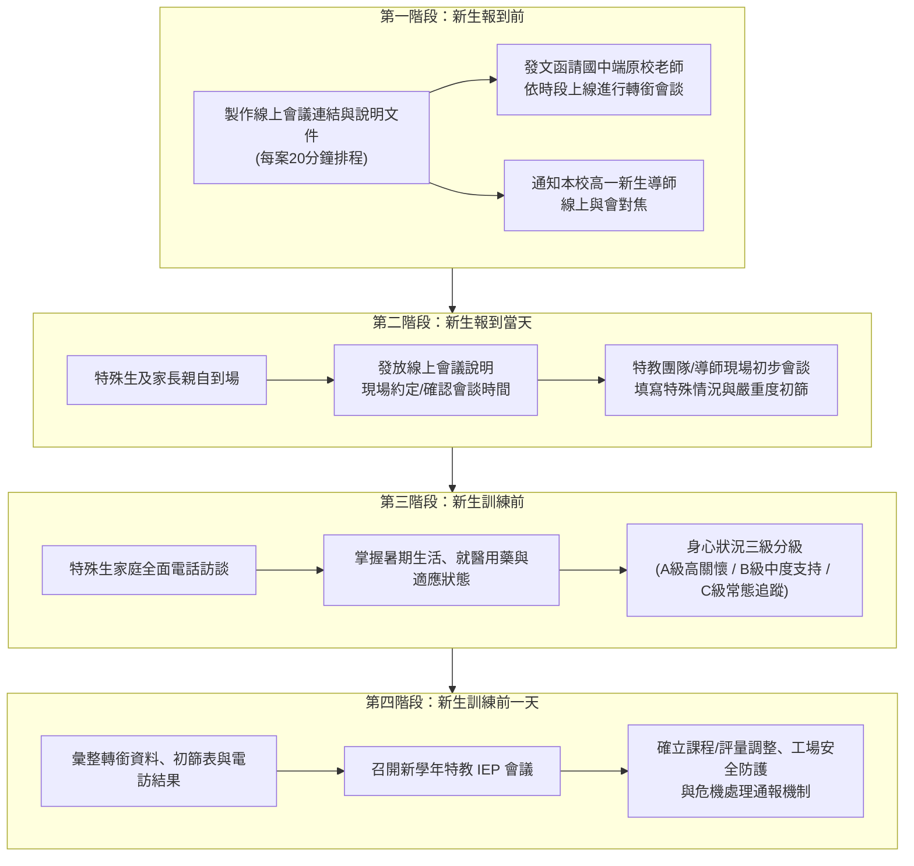

# 高一特教新生線上轉銜會談與 IEP 籌備標準作業流程 (SOP)

> **業務主責**：特教組 / 學習中心 / 跨處室協調（進修部、教務處、學務處）  
> **適用對象**：高一特殊教育日間部及進修部新生（含情障、自閉症、學障、感官障礙、肢障及腦麻等各類特殊生）  
> **核心目標**：透過「線上轉銜 $\rightarrow$ 報到初篩 $\rightarrow$ 暑期電訪分級 $\rightarrow$ 訓前 IEP」四階段無縫銜接，掌握學生特質、確保工場工安、協助班級導師預作準備。

---

## 🧭 四階段全時程推進藍圖 (Timeline & Workflow)



---

## 📋 第一階段：新生報到前（線上會議規劃、公文發函與導師通知）

### 1. 線上會議架構與 20 分鐘排程設計
- **會議平台**：Google Meet（或 Webex / Teams，以穩定且國中端易於操作者為首選）。
- **時段配當**：採「**一人 20 分鐘（15 分鐘核心對話 + 5 分鐘換場緩衝）**」密集排程。
- **排程表範本架構**：

| 序號 | 預定時段 | 特教學生代號/科別 | 原畢業國中 | 國中端出席人員 | 本校出席人員 | 視訊會議代碼/連結 | 備註（特殊需求） |
| :---: | :---: | :---: | :---: | :---: | :---: | :---: | :---: |
| 1 | 09:00 - 09:20 | 甲生（電機一甲） | ○○國中 | 特教個管、輔導老師 | 特教組長、導師、個管 | `meet.google.com/xxx-xxxx-xxx` | 具高度情緒焦慮 |
| 2 | 09:25 - 09:45 | 乙生（資訊一乙） | △△國中 | 導師、特教老師 | 特教組長、導師、個管 | `meet.google.com/xxx-xxxx-xxx` | 自閉症，視覺支持 |
| 3 | 09:50 - 10:10 | 丙生（進修資訊一） | □□國中 | 特教組長、個管 | 進修部特教個管、導師 | `meet.google.com/xxx-xxxx-xxx` | 夜間作息/工讀諮詢 |

### 2. 公文發函國中端（公文草案架構）
- **發文對象**：受分配轉銜之各公私立國民中學（副知：各主管教育局處）。
- **主旨**：函請 貴校惠予協助派員依排定時段參與「115學年度身心障礙新生轉銜視訊會談」，並核予公假登記，請 查照。
- **說明要點**：
  1. 依據《特殊教育法》第 28 條及各級學校特殊教育學生轉銜輔導與服務辦法辦理。
  2. 為使身心障礙新生順利銜接高級中等學校生活及技高工場實習環境，本校訂於 ○ 年 ○ 月 ○ 日辦理線上轉銜座談。
  3. 檢附「各校線上會談時段分配表及會議連結」（附件一）及「線上會議簽到與紀錄指引」（附件二），請貴校個管特教老師及三年級原導師依時段上線。
  4. 請於會前備妥教育部特教通報網轉銜服務資料、學生優弱勢能力評估及個別化教育計畫（IEP）核心建議。

### 3. 高一新生導師通知單
- [ ] 製作《高一新生導師參與轉銜會議通知書》：
  - 清楚說明導師出席時段與 Google Meet 連結。
  - **行前暖心叮嚀**：告知轉銜會談重在聆聽國中端對學生「有效安撫技巧、引導策略、同儕相處特質」之實務傳承，非質詢檢討。
  - 提供《轉銜會談導師速記表》（含學生興趣、地雷禁忌、常用情緒調節物、緊急聯絡方式）。

---

## 🏫 第二階段：新生報到當天（現場面談、說明發放與初篩評估）

### 1. 現場報到接待專區動線
- 於新生報到處設立**「學習中心 / 特殊教育諮詢專區」**，由特教老師（或凡鈺老師團隊）專責引導，保護學生身分隱私。
- **現場發放資料包**：
  1. 📄 **《線上轉銜會議家長說明書》**：包含會議目的、操作步驟 QR Code、約定之確切視訊時段。
  2. 📄 **《特殊教育支持服務介紹手冊》**：介紹技高學習中心功能、資源班課表彈性、專業實習支持、身障考試評量調整。
  3. 📄 **《緊急聯絡與身心健康通報卡》**（請家長當場填寫）。

### 2. 特教新生現場初篩與嚴重度評估表（初篩檢核）

現場會談時間約 5~10 分鐘，由特教老師針對以下五大面向快速進行初篩分級：

| 評估面向 | 觀察與訪談重點 | 程度核定 (輕/中/重) | 現場摘要紀錄與特徵註記 |
| :--- | :--- | :---: | :--- |
| **1. 情緒與行為狀態** | 對陌生環境反應、眼神接觸、是否有高焦慮/躁動/退縮、過往情緒失控頻率與觸發點 | ⚪輕 ⚪中 ⚪重 | |
| **2. 高工工場工安風險** | 粗細動作協調、對危險指令理解力、衝動控制能力、機械/用電實習耐受度 | ⚪輕 ⚪中 ⚪重 | *高工特重工場安全評估* |
| **3. 就醫與用藥情形** | 目前是否規則服藥、藥物副作用（嗜睡、注意力不集中）、服藥時間與劑量 | ⚪輕 ⚪中 ⚪重 | |
| **4. 溝通與同儕互動** | 口語表達流暢度、理解複雜指令能力、社交互動意願、自閉症固著語言或行為 | ⚪輕 ⚪中 ⚪重 | |
| **5. 家庭支持與期待** | 家長對特殊教育支持之態度（配合/過度保護/否認抗拒）、家庭變故或隔代教養 | ⚪優 ⚪可 ⚪弱 | |

> **嚴重度綜合初判**：  
> - 🟢 **輕度（常態融入）**：情緒穩定、理解力佳、服藥正常、工場工安無虞。  
> - 🟡 **中度（重點追蹤）**：易焦慮或退縮、理解略慢、需視覺或口語提示、工場需夥伴協同。  
> - 🔴 **重度（高風險/高支持）**：有自傷自傷史、重度情緒風暴、用藥不穩、工場操作極高風險、家長強烈焦慮。

---

## 📞 第三階段：新生訓練前（全面電訪聯繫與三級分級機制）

### 1. 全面電訪實務 SOP
- **電訪時間點**：報到後至新生訓練前一週（暑假中下旬），每戶電訪約 10~15 分鐘。
- **四大核心對焦問題**：
  1. 「暑假期間生活作息、睡眠與就醫用藥情況是否穩定？」
  2. 「孩子對於即將進入高工新環境（尤其是各專業科目、實習工場），有沒有表達期待或感到焦慮擔心的地方？」
  3. 「線上轉銜會議的時段與連結，家長與孩子操作上是否有任何困難需要學校協助？」
  4. 「新生訓練（始業輔導）是否有需要特別注意的身體狀況或行動支持（如：長照、爬樓梯、體育服裝）？」

### 2. 特教新生「三級支持分級機制」矩陣

電訪完成後，學習中心特教團隊召開內部對焦會議，正式完成名單分級：

```text
┌─────────────────────────────────────────────────────────────┐
│ 【A 級：高度關懷／危機預防群】                                 │
│ 條件：具自傷/傷人史、重度情障、嚴重拒學、用藥劇烈變動、工場高工安風險│
│ 配套：一對一特教個管專責、開學前安排實體到校減敏、爭取助理員進班、     │
│       提供導師專屬緊急危機處理流程卡 (SOP)                   │
├─────────────────────────────────────────────────────────────┤
│ 【B 級：中度關懷／結構支持群】                                 │
│ 條件：自閉症需結構化提示、學障需評量調整、社交適應不良、輕度情緒障礙  │
│ 配套：班級座位與工場友善同儕排定、開學前與科任教師說明評量調整方向、   │
│       學習中心每週固定安排支持晤談                             │
├─────────────────────────────────────────────────────────────┤
│ 【C 級：自主適應／常規列管群】                                 │
│ 條件：身心穩定、醫囑良好、家庭支持系統健全、具備獨立學習與實作能力    │
│ 配套：融入一般班級學習、定期期中/期末電訪追蹤、例行 IEP 檢核          │
└─────────────────────────────────────────────────────────────┘
```

---

## 🤝 第四階段：新生訓練前一天（IEP 會議召開實務）

### 1. 會議定位與參與對象
- **召開時機**：**新生訓練（始業輔導）前一日**。
- **主席**：特教組長 / 學習中心召集人（或由教務/實習主管指導）。
- **法定與關鍵出席人員**：
  - 特教學生家長及學生本人（鼓勵出席發表想法）。
  - 新生班級導師（必到）。
  - 核心任課教師代表（專業實習教師、國英數教師代表）。
  - 特教個管教師（如凡鈺老師）。
  - 相關專業人員（心理師、職能治療師、社工、助理員等視案列席）。

### 2. 會前資料包裹（IEP 審查資料夾）
- [ ] 整合匯入以下 4 大來源數據：
  1. 國中端線上轉銜會議紀錄表（過往有效輔導策略）。
  2. 新生報到當日現場初篩表。
  3. 暑假電訪追蹤紀錄與三級分級名單。
  4. 學生通報網特殊教育鑑定證明書與醫療診斷書。

### 3. IEP 會議四大核心決議項目檢核清單
- [ ] **1. 課程與學分調整方案**：
  - 是否申請學習中心抽離教學或課後補救教學？
  - 進修部/日間部之特殊教育服務節數確定。
- [ ] **2. 考試與評量調整措施**：
  - 延長作答時間（例如延長 20 分鐘）、試場獨立/單人試場、電腦作答、題目語音報讀。
- [ ] **3. 高工實習工場工安防護計畫**：
  - 明確記載實習工場操作之安全限制（如不得單獨操作旋轉機具、高壓電實習須有專人陪同）。
  - 排定工場座位與專屬實習安全互助夥伴。
- [ ] **4. 情緒風暴與突發危機處理 SOP**：
  - 訂定學生情緒爆發時之「安靜冷靜區」（如學習中心諮商室）。
  - 訂定第一線導師、教官室/學務處、特教組之緊急通報動線。
- [ ] **5. 特教支持服務與輔具申請**：
  - 特教學生助理人員進班時數申請、輔具借用（如調頻助聽器、擴視機、特殊座椅）。

---

## ⚡ 週一（2026-09-07）與凡鈺老師對焦轉銜 SOP 之行政清單

在週一下午與凡鈺老師討論時，可直接依本 SOP 逐項對焦落地工作：

1. **時程確認**：
   - 敲定線上轉銜會議週次與 Google Meet 會議代碼分配。
   - 確認新生報到日「特教諮詢櫃檯」值班特教師資排班。
2. **公文與文件起草**：
   - 啟動發文至各國中端之公文簽核流程（附件排程表每人 20 分鐘）。
   - 審查「線上轉銜會議家長說明書」與「現場初篩表」格式。
3. **電訪與分級機制權責**：
   - 分配暑假電訪名冊，並約定電訪後「A/B/C 三級分級判定標準」。
4. **訓前 IEP 會議推動**：
   - 預先通知高一新生導師與實習科任老師預留「新生訓練前一日」會議時段，確保出席率百分百。
