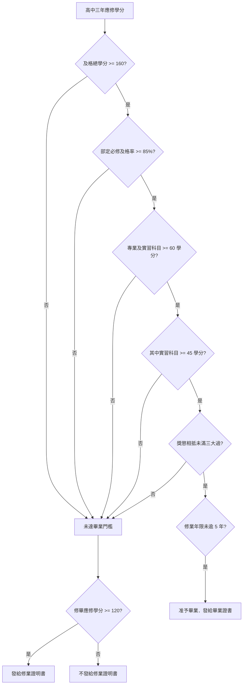
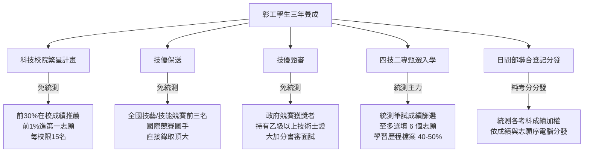

# 國立彰化師範大學附屬高級工業職業學校
# 技高學生畢業標準、學分採計規準與四技二專升學進路知識指引

> **法規依據**：教育部「高級中等學校學生學習評量辦法」及本校「學生學習評量辦法補充規定」  
> **資料來源**：教務處報告（115 學年度新生訓練導師行前會議簡報）  
> **適用場景**：教務行政常備查閱、新生入學宣導、各班導師親師座談會諮詢、輔導處生涯輔導  
> **關聯筆記**：[[04_導師與學生事務/2026-09-12_親師座談會導師宣導簡報規劃與講稿]]

---

## 壹、學生學習評量規定（畢業條件與證書發給）

技術型高級中等學校學生於修業年限內修畢課程綱要所規定之應修學分，其成績考查結果符合下列各款標準者，准予畢業並發給**畢業證書**：

### 一、畢業條件檢核標準 (Graduation Requirements)

| 檢核項目 | 法定及格標準門檻 | 說明與重點提示 |
| :--- | :---: | :--- |
| **最低畢業學分門檻** | **160 學分** | 三年修畢及格之總學分數，不得低於 160 學分。 |
| **部定必修科目** | **至少 85% 及格** | 由教育部統一訂定之核心必修科目（國、英、數、社會、自然、專業基礎等），及格學分需達 85% 以上。 |
| **專業及實習科目** | **至少及格 60 學分** | 技高學生核心專業技術素養門檻，專業與實習學分合計至少 60 學分。 |
| **實習科目（含實驗/實務）** | **至少及格 45 學分** | 上述 60 學分中，親手實作之**實習科目必須佔 45 學分以上**（工科最核心規準）。 |
| **德行評量規範** | **未滿三大過** | 功過相抵後，累計未滿三大過者。 |
| **修業年限** | **未逾五年** | 含重讀、延修，但不包括休學期間。 |

---

### 二、修業證明書發給規定 (Certificate of Completion)

- 學生成績考查結果未符合上述畢業規定者，若**已修畢 120 個畢業應修學分數**，由學校發給**修業證明書**。
- 修業證明書可作為報考同等學力升學之證明，但未取得正式畢業資格。

---

### 三、學分採計基準與成績評定

各年級學期成績及格分數基準如下表：

| 身分別 | 高一及格基準 | 高二及格基準 | 高三及格基準 | 備註 |
| :--- | :---: | :---: | :---: | :--- |
| **一般生** | **60 分** | **60 分** | **60 分** | 每學期學業成績達 60 分即取得該科全額學分 |
| **優待辦法規定入學學生** | 40 分 | 50 分 | 60 分 | 原住民、重大災害地區、派外人員子女、退伍軍人、僑生、外國學生等專案核定者 |
| **技藝技能優良學生 (技優入學)** | 50 分 | 50 分 | 60 分 | 技藝技能甄審及保送入學者 |
| **運動成績優良學生 (體育入學)** | 40 分 | 40 分 | 50 分 | 運動成績甄審及保送入學者 |

---

### 四、減修學分與重讀規定 (Academic Warning & Retention)

1. **減修學分（學期預警機制）**：
   - 學生各學年度**第一學期取得之學分數，未達該學期修習總學分數二分之一 ($1/2$) 者**，第二學期得由學校輔導其**減修學分**。
2. **重讀規定（學年預警與留級制度）**：
   - 學生各學年度**取得之學分數，未達該學年度修習總學分數二分之一 ($1/2$) 者，得依規定重讀**。
   - **學分數認定計算**：該學年度取得之學分數，應包括該學年度結束前**補考、重修及補修後取得之學分**。

---

## 貳、重補修要點與數位化申請作業 (Credit Recovery)

為維護學生受教權益並協助及時挽救學分，學校訂有嚴謹的重補修要點：

### 一、基本作業要點

- **實施對象**：
  - **重修**：學生各學期學業成績未達及格基準之科目，得申請重修。
  - **補修**：轉學生、轉科生因課程差異未修習之科目，依規定申請補修。
- **實施方式（自主申請制）**：
  - 重（補）修學生**應主動提出申請**；未在規定期限內提出申請者，**視同放棄重（補）修權利**。
- **修習學分上限**：
  - **一般在校生**：每學期以 **10 學分**為上限。
  - **延修生**：每學期以 **30 學分**為上限。
- **申請時間原則**：
  - 第一學期之重（補）修：於**第二學期**提出申請。
  - 第二學期之重（補）修：於**第一學期**提出申請。
- **開班類別與門檻**：
  - **專班重修**：申請人數達 **15 人以上（含 15 人）**，開設專班面授教學。
  - **自學輔導**：申請人數**未滿 15 人**，由指派教師指定教材、安排進度輔導並進行學習評量。
- **開班經費原則**：
  - 申請人數未達單科收支平衡之科目，經學校核准後得考量修課權益開課，全學期以整體經費收支平衡為原則。

---

### 二、重補修申請流程重大變革（全面線上化）

> [!IMPORTANT]
> **全面改採 ischool 線上申請，校網首頁設置「重修專區」！**  
> 過去紙本畫單流程全面取消，避免單據遺失與延誤。

1. **線上申請管道**：全面採用校務行政系統 **ischool 線上申請**。
2. **申請時程範例（以 115-1 為例）**：
   - ⏰ 開放登記時間：**9/3 (四) 17:00 ～ 9/8 (二) 23:00 截止**。
   - 系統逾時自動關閉，逾期概不受理，導師務必及早提醒學生。
3. **校網「重修專區」查詢**：
   - 彰師附工首頁已建置專屬「**重修專區**」。
   - 公告事項：開課科目、名冊、課表、面授地點、自學輔導教師、繳費單下載等即時資訊。

---

## 參、四技二專多元升學進路全景解析 (Higher Education Pathways)

技術型高中學生的升學管道極為豐富，可分為「免統測在校實力型」、「免統測技能拔尖型」與「統測考試實力型」三大類型：

---

### 一、科技校院繁星計畫（免採計統測成績）

科技校院繁星計畫旨在落實就近入學與照顧偏鄉，全看學生高一至高三上在校表現。

- **推薦資格門檻**：
  - 在校學業成績排名（全年級或科組）**前 30%** 者，具備校內初選推薦資格。
  - **各高職學校至多可推薦考生 15 名**。
- **錄取競爭實況**：
  - 欲錄取國立頂尖科技大學（台科大、北科大等第一志願校系），通常在校學業成績需達到**前 1%**。
- **七大比序項目與優先順序**：
  1. **比序一**：高一至高三上 5 學期「**學業平均成績**」之群名次百分比。
  2. **比序二**：高一至高三上 5 學期「**專業及實習科目平均成績**」之群名次百分比（*註：專習科目指部定必修科目，以課務組公告為準*）。
  3. **比序三**：高一至高三上 5 學期「**國文**」之群名次百分比。
  4. **比序四**：高一至高三上 5 學期「**英文**」之群名次百分比。
  5. **比序五**：高一至高三上 5 學期「**數學**」之群名次百分比。
  6. **比序六**：「**競賽、證照及語文能力檢定**」之總合成績。
  7. **比序七**：「**學校幹部、志工、社會服務及社團參與**」之總合成績。

---

### 二、技優保送（不採計統測成績）

專為頂尖技能選手量身打造之尊榮入學管道，直接保送頂尖公立科大：

- **資格條件**：
  - 國際技能競賽 / 國際展能節職業技能競賽 / 國際科技展覽 — 前三名或優勝者。
  - 國際技能競賽 / 國際展能節職業技能競賽 — 國手資格者。
  - **全國技能競賽 / 全國高級中等學校技藝競賽 / 全國身心障礙者技能競賽 — 各職類獲前三名者**。
- **分發機制**：依得獎職類直接選填志願分發，不需參加筆試。

---

### 三、技優甄審（不採計統測成績）

肯定技術技能成就之廣泛入學管道，高職生最具爆發力之升學途徑：

- **資格條件**：
  - 凡取得政府主管機關認可之各項競賽獲獎者。
  - **持有「乙級以上技術士證」者**。
- **計分與錄取**：
  - 不採計統測成績。
  - 競賽或乙級證照依規定折算甄審總成績加分（乙級證照加分高達 15%）。
  - 各大專校院依書面審查資料（在校專題、實習歷程）與實作/面試評定錄取。

---

### 四、甄選入學（四技二專最主要招生管道）

四技二專招生容量最大、錄取人數最多之旗艦管道：

- **基本資格**：必須報名並參加「四技二專統一入學測驗 (統測)」。
- **選填志願**：考生至多可選填 **6 個校系志願**。
- **兩階段甄選程序**：
  - **第一階段（統測篩選）**：依各校系訂定之統測考科組合與倍率，篩選進入二階名單。
  - **第二階段（綜合甄試）**：
    - **統測成績佔比**：通常佔 40%～50%。
    - **學習歷程檔案審查**：佔比高達 40%～50%（含修課紀錄、課程學習成果、多元表現、專題實作、學習歷程自述等）。
    - **到校甄試**：包含面試、筆試或術科實作測驗。

---

### 五、聯合登記分發（純考分大分發）

- **資格**：具有統測成績且達各類群分發門檻之考生。
- **特色**：完全不採計在校成績與學習歷程檔案，純粹依照**統測各考科加權總分**與考生志願順序進行電腦全國分發。

---

## 肆、教務處各組業務執掌與分機通訊錄

為利導師與學生家長諮詢相關學業、升學與重補修業務，各組業務窗口如下：

| 組別 | 負責人 | 核心執掌事項 | 協辦/組員 | 分機 |
| :--- | :--- | :--- | :--- | :---: |
| **教務主任** | 黃正誼 主任 | 綜理全校教務工作、規劃執行教務發展、校務發展協調 | — | **270** |
| **教學組** | 陳姚萍 組長 | 課程編排、教學實施、課業考查（教學進度表）、教師專業發展 | 林育瑜、鄭羽鈞 | **223** |
| **註冊組** | 賴威東 組長 | **學籍管理、成績考查、學生證發給、獎學金辦理、減免學雜費、招生及升學業務** | 林正議、林政葦 | **206** |
| **課務組** | 林雅真 組長 黃常育 老師 | **高中職新課綱發展、學生重補修、課程選修、各科教科書彙整、彈性學習** | 鄭羽鈞（兼辦） | **272** |
| **實驗研究組** | 潘志軒 組長 | 實驗研究、教育實習、專案計畫推動 | 林育瑜（兼辦）、陳瑩芳 | **272** |
| **設備組** | 陳怡誠 組長 | 教學設備管理、教具借用、特別教室管理、科學教育活動、**學校網站管理（重修專區）** | — | **253** |
| **學習中心** | 楊珺安 老師 等 4 位 | 特教推行委員會、資源班課務與行政、資源班學生個別化支持輔導 | 助理員 張惠竹 | **204** |
| **資安業務** | 廖茂松 先生 | 資通安全委員會推動、校園資安計畫規劃執行、校園網路規劃維護 | — | **207** |

---

## 伍、教務核心精神與校訓銘言

- **彰工校訓**：
  - **誠**：不虛偽作假，不苟且自欺；要忠實懇摯，要純真自然。
  - **正**：不偏攲邪曲，不投機鑽營；要端莊爽直，要清白光明。
  - **專**：不多志旁騖，不見異思遷；要一心專注，要慎始敬終。
  - **精**：不粗率籠統，不膚淺自矜；要深刻細密，要日新又新。
- **教育金句**：
  > **「老師是你的神隊友導航員，但絕不是你的代駕！掌控主導權：路怎麼走、油門怎麼踩，掌控權永遠在你自己手上。」**

---

## 陸、教育部重大教育政策宣導：數位學習實施計畫與家長宣講

配合教育部「生生用平板、數位學習精進方案」，為營造優質且安全之數位學習環境，教育部針對高級中等學校訂定推廣計畫，並發布家長專屬政策宣講素材：

- **計畫名稱**：115 年教育部所轄高級中等學校數位學習實施計畫
- **官方宣導影片**：[115 年家長數位學習政策宣講影片 (YouTube 觀看)](https://www.youtube.com/watch?app=desktop&v=XvJeVCqO40s)
- **宣導核心價值**：
  - **核心金句**：**「我們要做 AI 的規畫師，而不是我們被 AI 所規劃！」**（培養主動掌控與引導工具之能力，避免淪為演算法被動接收者）。
  - **「疏導勝於圍堵」**：在 AI 與數位載具普及的時代，以適性輔導與思辨引導代替單純阻絕。
  - **三安環境**：創造「學生安心、教師專心、家長放心」之數位教育環境。
- **《家長數位學習知能指引》推廣五大主軸**：
  1. 掌握數位科技融入教學與未來趨勢。
  2. 善用優質自學診斷平臺（因材網、酷英網等大數據適性診斷）。
  3. 啟動健康家庭數位學習支持系統（親子約定載具使用時數、護眼守則）。
  4. 善用生成式 AI 輔助孩子思辨與探究（避免抄襲、培育判斷力）。
  5. 指導孩子注重資訊倫理、網路隱私保護與防範詐騙。
- **學校推廣管道**：各班親師座談會現場播放宣講、校網首頁設置專區連結與 QR Code 提供家長下載指引。
